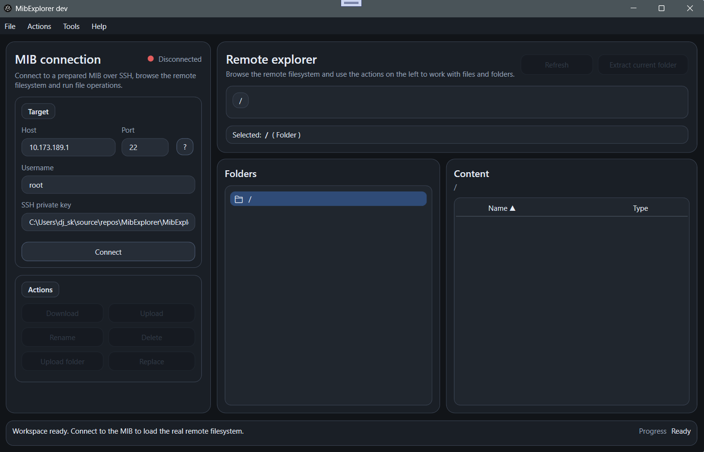

# MibExplorer

**MibExplorer** is a WPF (.NET 8) application for exploring and managing files on **Volkswagen MIB2 / MIB2.5** systems over SSH.

It provides a graphical interface to browse the remote filesystem, transfer files and folders, perform safe replace operations, and work around Linux filenames that are not directly compatible with Windows.

---

## Features

### Remote file explorer
- Browse the MIB filesystem with a synchronized **TreeView + ListView**
- Lazy loading for remote folders
- Double-click navigation
- Right-click context menus for files and folders

### File operations
- Download file
- Upload file
- Rename file or folder
- Delete file or folder
- Refresh current folder

### Folder operations
- Extract folder locally
- Upload folder recursively
- Safe folder replace with:
  - temporary upload
  - backup
  - atomic swap
  - cleanup

### Smart filename mapping
- Handles Linux filenames that are invalid on Windows
- Generates `.mibexplorer-map.json` only when needed
- Restores original remote names when re-uploading extracted folders
- Ensures reliable **extract → modify → re-upload** workflow

### SSH key utilities
- Generate RSA key pair directly from the application
- Use generated keys for new SSH setups
- Support existing private keys for already prepared MIB systems

---

## Safety

MibExplorer is designed to keep filesystem operations as safe as possible.

- Remote write operations are performed with controlled RW/RO remount handling
- Safe replace avoids destructive direct overwrite operations
- Folder uploads support filename replay for sanitized names
- `.mibexplorer-map.json` is never uploaded to the MIB
- No operation is executed unless explicitly triggered by the user

---

## Requirements

- Windows 10 or Windows 11
- .NET 8 Runtime
- A Volkswagen MIB2 / MIB2.5 unit with SSH access available

---

## SSH setup

MibExplorer connects to the MIB over SSH using an RSA private key.

There are currently two main scenarios.

### 1. New setup: generate keys from MibExplorer
If your MIB is not yet prepared, MibExplorer can generate a new RSA key pair for you.

Typical workflow:
1. Open **Tools > Generate SSH Keys**
2. Generate a new key pair
3. Keep the **private key** on your PC
4. Copy the **public key** (`.pub`) to the MIB during your SSH enable/install process
5. Use the generated private key in MibExplorer to connect

This is the recommended approach for new setups because it gives you a dedicated key pair for the application.

### 2. Existing setup: use your current private key
If your MIB is already configured for SSH, you do **not** need to generate new keys.

You can simply use the private key that already matches the public key installed on the MIB.

Typical workflow:
1. Make sure SSH is already working on the MIB
2. Locate the private key on your PC
3. In MibExplorer, select that private key
4. Connect to the MIB normally

This is the recommended approach for users whose MIB is already prepared.

---

## Connecting to the MIB

Basic connection flow:

1. Start MibExplorer
2. Enter the MIB IP address
3. Select your RSA private key
4. Connect over SSH
5. Browse and manage the filesystem

If the connection fails, verify:
- the MIB IP address
- SSH availability on the MIB
- that the selected private key matches the public key installed on the MIB
- that the MIB and PC are on the same network

---

## Working with existing SSH-enabled MIB systems

If your MIB is already configured with SSH access through another method or tool, MibExplorer can still be used directly.

You only need:
- the MIB IP address
- the matching private key

No reinstallation is required as long as SSH access is already available and your key is accepted by the MIB.

---

## Folder extraction and filename replay

Some files on the MIB may use Linux-valid names that are not valid on Windows.

To preserve those names safely:

- folder extraction sanitizes invalid local names when necessary
- MibExplorer creates `.mibexplorer-map.json` only if at least one name had to be adapted
- when uploading that folder again, MibExplorer replays the original remote Linux names automatically

This makes it possible to:
- extract a folder from the MIB
- edit it locally on Windows
- upload it back without breaking original filenames

---

## Current capabilities

MibExplorer currently supports:

- stable SSH connection
- remote filesystem navigation
- file download/upload
- file and folder rename
- file and folder delete
- folder extraction
- recursive folder upload
- safe folder replace
- filename mapping replay
- synchronized TreeView/ListView navigation
- context menus for file and folder operations

---

## Planned next steps

Planned future improvements include:

- SD card bootstrap package generation
- automatic SSH/Wi-Fi setup workflow
- guided operations
- MibExplorerAgent for local operation execution on the MIB side

---

## Notes

- This project is focused on practicality, safety, and usability
- It is intended for users already familiar with MIB filesystem access and SSH-based workflows
- Some future features are planned to simplify first-time setup

---

## Disclaimer

This tool is intended for advanced users.

Modifying files on a MIB system always carries risk.  
You are responsible for what you do with your device.

Use it carefully and at your own risk.

---

## Acknowledgements

This project is inspired by the MIB modding ecosystem and by community tools such as:

- MIB2Toolbox
- MoreIncredibleBash

---

## License

License to be defined.