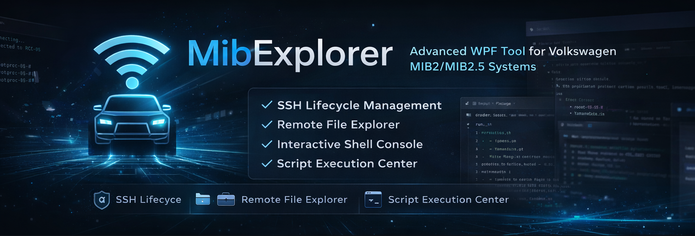

# MibExplorer

<p align="center">
  
</p>

**MibExplorer** is a powerful WPF tool for exploring and controlling **Volkswagen MIB2/MIB2.5** systems over SSH.

Built for advanced users, reverse engineering, and deep MIB system access.


It provides:
- a **graphical file explorer**
- a **complete SSH lifecycle management system**
- an **interactive remote shell console**
- a **built-in remote file editor with inline diff**
- an **advanced side-by-side file diff viewer**
- and a **powerful Script Center for remote execution**

---

# ✨ Key Features

## 📁 Remote File Explorer

- Full remote filesystem browsing (TreeView + ListView)
- Lazy loading for performance
- Context menu operations (files & folders)
- Symlink support
- Hidden files support

---

## 🔁 File & Folder Operations

- Download / upload files
- Rename / delete files and folders
- Recursive folder upload
- Folder extraction
- Safe folder replace with backup and atomic swap

---

## 🖥️ Remote Shell Console

- Persistent SSH session
- Interactive command execution
- Live output display
- Command history navigation
- Copy / save output
- Themed UI

---

## 🧩 Script Center


MibExplorer includes a built-in Script Center to execute scripts on the MIB via SSH.

### Features

- Execute scripts directly on the MIB
- Supports:
  - single scripts
  - full script packages (`run.sh`)
- Automatic workflow:
  - upload to `/tmp`
  - chmod +x
  - execute
  - capture output
  - cleanup

- Automatic update detection for Official scripts
  - Visual indicator when updates are available
  - Silent behavior if internet is unavailable

---

### Behavior

- Scripts run in isolated temp directory
- Root execution
- No persistent changes unless scripted
- Cleanup handled automatically

⚠️ Scripts run as root. Always review them.

---

## 🌐 Official Script Distribution

MibExplorer includes a system to manage official scripts directly from GitHub.

### Features

- One-click update via **Update Official**
- Automatic update detection
- Scripts are dynamically fetched (no app update required)
- Separation between:
  - `Official/` (managed)
  - `Custom/` (user scripts)

### Structure

```
Scripts/
    Official/
        manifest.json
        ScriptName/
    Custom/
        YourScripts.sh
```

### Manifest (v2)

```
{
  "PackagesScripts": [
    {
      "Name": "SvmFix",
      "Version": "1.0.0",
      "Sha256": "..."
    }
  ],
  "SingleScripts": [
    {
      "Name": "ExtractSkin0ImageMcfToSd.sh",
      "Version": "1.0.0",
      "Sha256": "..."
    }
  ]
}
```

### Behavior

- The `Official/` folder is fully managed and mirrored by MibExplorer
- Only changed scripts are downloaded (SHA-256 based)
- Removed scripts are automatically deleted locally
- Local modifications in `Official/` may be overwritten

### Benefits

- Always up-to-date scripts
- Efficient updates
- Reliable change detection (SHA-256)
- Cleaner releases
- Safer script distribution

---

## 🧰 Script Center SDK

A lightweight SDK is provided to build compatible scripts.

### Location

```
Scripts/Examples/TemplatePackage/
```

### Script Header Convention

```
#!/bin/sh
# Type: ReadOnly | Apply | Dangerous
# Version: x.y.z
# Description line 1
# Description line 2
# Description line 3
```

### Rules

- First line defines script type
- Second line defines version
- Up to 3 description lines supported
- Official scripts are validated using SHA-256

---

## 🧑‍💻 Remote File Editor

- Full remote editing
- Atomic save
- RW/RO handling
- Reload support
- Unsaved changes protection

---

## 🔍 Advanced Diff Viewer

- Side-by-side diff
- Accurate change detection
- Navigation support

---

## 🔐 SSH Management

- Install / update / uninstall SSH
- Key management
- Safe configuration handling

---

## 🌐 Auto IP Detection

- Detects MIB hotspot IP automatically
- No internet required

---

## 🛡️ Safety

- Atomic operations
- Backup system
- No destructive automation
- Full user control

---

## 📦 Capabilities

- SSH management
- File explorer
- Script Center
- File editor
- Diff viewer
- Auto IP detection
- Official script distribution with versioning and SHA-based updates

---

## 📄 License

MIT License

---

## ⚠️ Disclaimer

This software is free.  
If you paid for it, you were scammed.

Use at your own risk.
