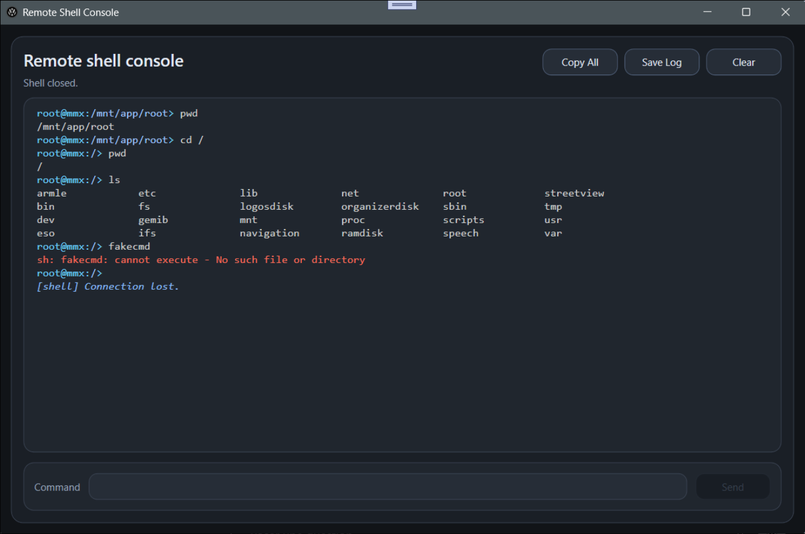
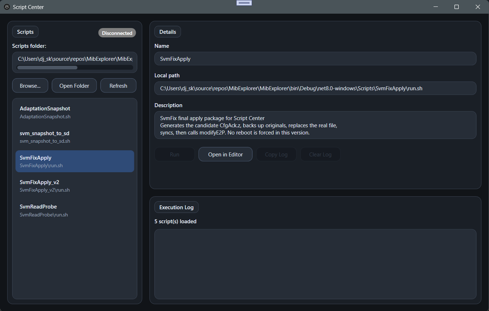
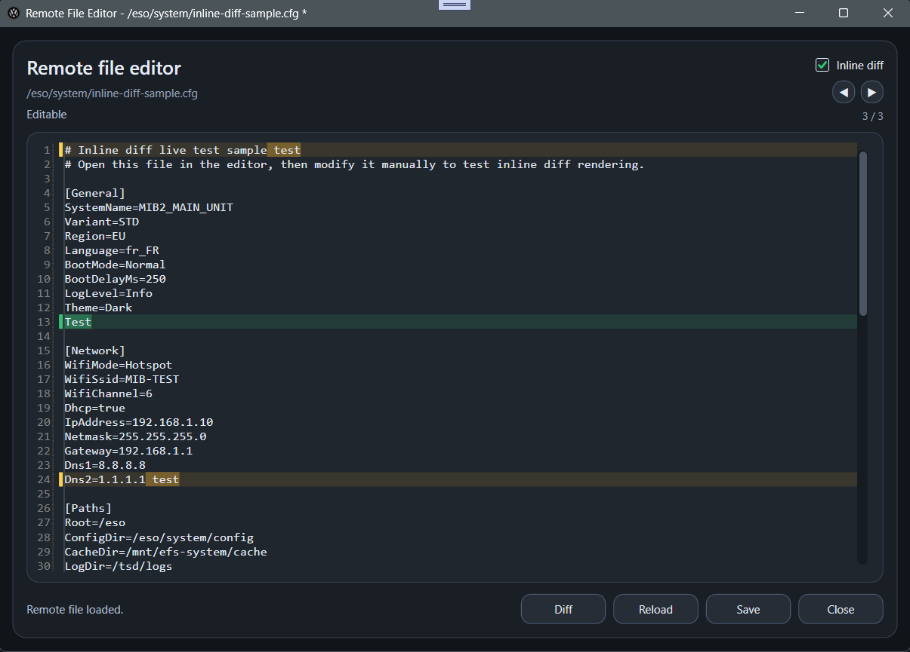
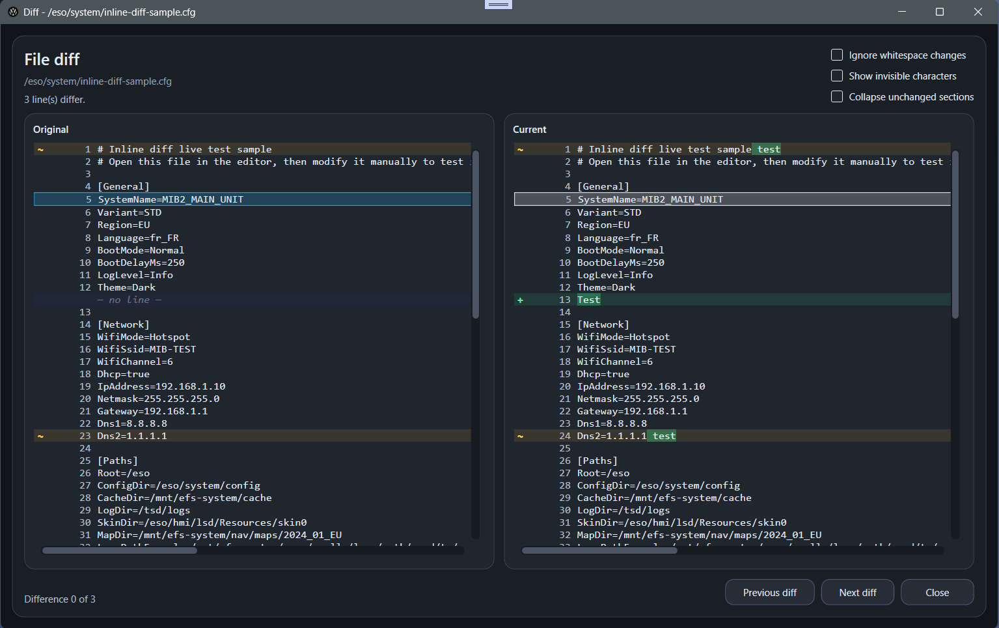

# MibExplorer

**MibExplorer** is a WPF (.NET 8) application designed to interact with **Volkswagen MIB2 / MIB2.5** systems over SSH.

It provides:
- a **graphical file explorer**
- a **complete SSH lifecycle management system**
- an **interactive remote shell console**
- a **built-in remote file editor with inline diff**
- an **advanced side-by-side file diff viewer**
- and a **powerful Script Center for remote execution**

---

# ✨ Key Features

## 📁 Remote File Explorer

* Full remote filesystem browsing (TreeView + ListView)
* Lazy loading for performance
* Context menu operations (files & folders)
* Symlink support (navigation + visibility)
* Hidden files support

---

## 🔁 File & Folder Operations

* Download / upload files
* Rename / delete files and folders
* Recursive folder upload
* Folder extraction
* **Safe folder replace**:

  * temporary upload
  * backup
  * atomic swap
  * cleanup

---

## 🧠 Smart Filename Mapping

* Handles Linux filenames incompatible with Windows
* Generates `.mibexplorer-map.json` only when required
* Restores original filenames on re-upload
* Enables safe **extract → edit → re-upload** workflows

---

## 🖥️ Remote Shell Console

MibExplorer includes a **built-in interactive remote shell console**.

---

### Features

* Real persistent SSH shell session (no command emulation)
* Interactive command execution
* Live remote output display
* Command history navigation (Up / Down)
* Clear console (`Ctrl + L`)
* Copy all output
* Save console log to file
* Themed context menu
* Single console instance management

---

### Console Rendering

* Terminal-like prompt and command flow
* Prompt-aware formatting:
  * user/host (cyan)
  * path (light blue)
* Distinct colors for:
  * commands (white)
  * normal output (light gray)
  * errors (red)
  * warnings (orange)
  * system messages `[shell]` (blue, italic)
* Clean spacing and improved readability
* Output trimming to prevent memory overflow

---

### Behavior

* Detects SSH connection loss in real time
* Automatically disables input when disconnected
* Keeps log available after disconnection
* Fully integrated with MibExplorer theme and UI

---

### Integration

* Open folders directly from the file explorer
* Right-click → **Open in Shell**
* Automatically navigates to the selected path

---

## 🧩 Script Center

MibExplorer now includes a built-in **Script Center**, allowing you to execute custom scripts directly on the MIB over SSH.

---

### Features

* Execute local scripts on the MIB
* Supports:
  * single scripts
  * full script packages (folder with `run.sh`)
* Automatic workflow:
  * upload to remote `/tmp`
  * set execution permissions
  * execute script
  * capture output
  * automatic cleanup

---

### Execution Log

* Real-time output streaming
* Clear and structured log display
* Copy log to clipboard
* Clear log functionality
* Displays remote execution workspace

---

### Behavior

* Scripts are executed in an isolated temporary directory
* No persistent modification unless explicitly done by the script
* Automatic cleanup after execution
* Exit code detection and reporting

---

### Integration

* Fully integrated into MibExplorer UI
* Uses existing SSH connection
* Designed for advanced workflows:
  * diagnostics
  * reverse engineering
  * system inspection
  * SVM-related operations

---

### Notes

* Scripts must be compatible with QNX shell environment
* Limited toolset on MIB (no full GNU environment)
* Line endings must be LF (`\n`)

⚠️ Scripts are executed with root privileges on the MIB.

---

## 🧑‍💻 Remote File Editor

MibExplorer includes a built-in **remote file editor** for editing files directly on the MIB over SSH.

### Features

* Open files from explorer (double-click / context menu)
* Full text editing over SSH
* Explicit save with overwrite
* Atomic save (temporary file + replace)
* RW mount handling for writable paths
* Read-only fallback for protected areas
* Reload file support
* Unsaved changes protection (Save / Discard / Cancel)

---

### Inline Diff (New)

The editor now includes a built-in **inline diff system**, allowing you to visualize changes directly inside the file.

#### Features

* Line-level highlighting (added / modified)
* Inline token-level diff highlighting
* Dedicated left gutter markers
* Fully synchronized with the diff viewer
* Toggle inline diff on/off instantly

---

### Diff Navigation

* Navigate between changes directly inside the editor
* Previous / Next controls
* Live position indicator (n / total)
* Caret-aware navigation behavior

---

## 🔍 Advanced File Diff Viewer

MibExplorer includes a powerful **side-by-side diff viewer** to validate changes before saving.

### Features

* Side-by-side comparison (Original vs Current)
* Line-level and token-level diff
* Accurate detection of:
  * additions
  * deletions
  * modifications
* Smart alignment using LCS-based algorithm
* Automatic merging of similar add/remove pairs into modified lines
* Git-like grouping of repeated change markers
* Navigation between differences
* Collapsible unchanged sections

---

### Diff Options

* Ignore whitespace changes
* Show invisible characters (spaces, tabs)
* Collapse unchanged sections

---

### Whitespace Handling

* Consistent tab rendering (tab size = 4)
* Unified whitespace handling between editor and diff
* Accurate alignment for column-based text
* No mismatch between tabs and spaces rendering

---

### Behavior

* No false "modified lines" after deletions
* Stable diff even with complex edits
* Designed for real-world MIB file structures

---

# 🔐 SSH Management (Core Feature)

MibExplorer provides a **complete SSH lifecycle system** for MIB devices.

---

## 📦 SSH Installation (via SD SWDL)

* Generates a full SWDL-compatible SD package
* No external tools required
* Includes:

  * SSH payload (sshd)
  * public key (GEM)
  * scripts and checksums

### Install process:

* Deploys SSH to MIB filesystem
* Patches `startup.sh` safely (with backup)
* Configures:

  * inetd (SSH service)
  * firewall (pf*.conf)
* Uses boot-time finalizer (`finish_ssh_boot.sh`)
* Generates host keys on first boot
* Logs execution to SD card

### Cleanup:

* Removes SWDL temporary files
* Removes `MibExplorer.info` (FileCopyInfo)

---

## 🔁 SSH Key Update (No reinstall)

* Replaces only `authorized_keys`
* No payload reinstall
* No system modification
* Fast and safe

---

## 🧹 SSH Uninstall (via SD)

* Full uninstall using SWDL package
* Safe post-reboot cleanup
* Removes:

  * SSH payload
  * `/root/.ssh`
  * `authorized_keys`
  * `/root/scp`
  * `/root/.profile`
* Restores:

  * `inetd.conf`
  * firewall rules
* Removes:

  * SWDL artifacts
  * `MibExplorer.info`
* Keeps `startup.sh` hook intentionally

---

## ⚡ Direct SSH Uninstall (No SD Required)

* Uninstall SSH directly from MibExplorer
* Requires active SSH connection

### Behavior:

* Removes:

  * SSH payload
  * `/root/.ssh`
  * defensive cleanup of `/root/.sshd`
  * `authorized_keys`
  * `scp`
  * `.profile`

* Restores:

  * `inetd.conf` (backup or fallback)
  * firewall rules

* Cleans:

  * SWDL artifacts
  * `MibExplorer.info`

### Notes:

* SSH session may remain active until reboot
* Reboot is recommended after uninstall
* `startup.sh` hook is preserved

---

# 🌐 Automatic MIB IP Detection

* Detects active Wi-Fi interface (MIB hotspot)
* Works without internet access
* Uses:

  * default gateway
  * or DHCP fallback
* Validates IP via SSH (port 22)

👉 Eliminates false detections and improves reliability

---

# 🛡️ Safety & Design

MibExplorer is built with a strong focus on **safety and reversibility**:

* Controlled RW/RO remount handling
* Atomic file operations
* Backup-based restore logic
* Defensive cleanup mechanisms
* No automatic destructive actions
* Full user control over operations

---

# 🔌 Requirements

* Windows 10 / 11
* .NET 8 Runtime
* Volkswagen MIB2 / MIB2.5 with SSH capability

---

# 🔑 SSH Setup

## New setup

1. Tools → Generate SSH Keys
2. Install SSH via SD package
3. Connect using generated private key

---

## Existing setup

* Use your existing private key
* No reinstall required

---

# 🔗 Connecting to MIB

1. Connect PC to MIB Wi-Fi hotspot
2. Use auto-detect (recommended) or enter IP manually
3. Select private key
4. Connect

---

# 📦 Current Capabilities

* SSH install / update / uninstall (SD + direct)
* Remote filesystem explorer
* File & folder operations
* Safe replace system
* Smart filename mapping
* Remote shell console
* Script Center (script execution on MIB)
* Remote file editor
* Inline diff editor (line + token level)
* Diff navigation inside editor
* Advanced file diff viewer
* IP auto-detection with validation

---

# 🧩 Roadmap

Planned improvements:

* Integrated SSH setup wizard
* MIB Wi-Fi helper / onboarding
* Advanced diagnostics tools
* MIB-side helper agent
* Advanced Script Center features (automation, presets, tooling)

---

# ⚠️ Disclaimer

This tool is intended for advanced users.

Modifying a MIB system always carries risk.
You are responsible for any changes made to your device.

---

# 🙏 Acknowledgements

Inspired by the MIB modding ecosystem:

* MIB2Toolbox
* MoreIncredibleBash

---

# 📄 License

To be defined.